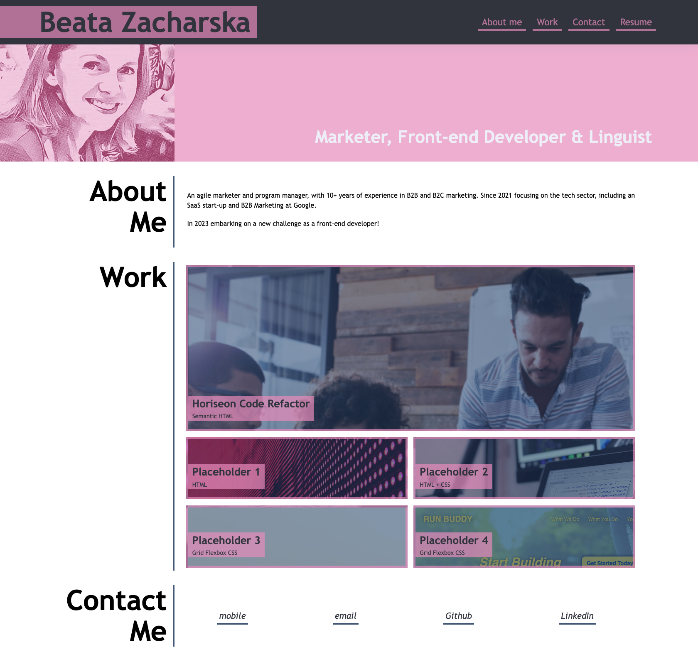
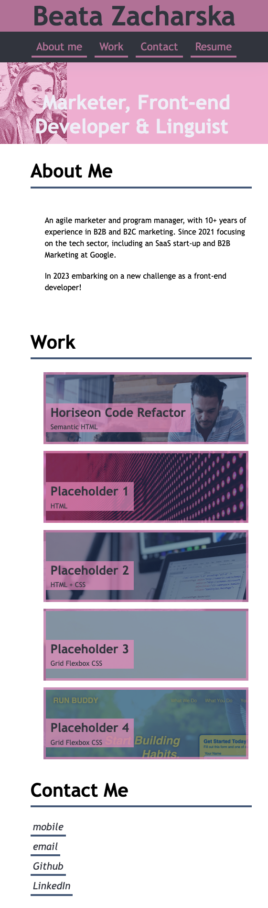

# Beata's Portfolio 2022
Deployed link: https://beazach.github.io/portfolio-2022/

## Description 
The portfolio showcases the work I've completed during the developers' bootcamp, with each section displaying different projects, including links to deployed applications.

## Usage
- The look and feel of the page has been customised based on the provided mock-up and developer's own preference.

- CSS Flexbox has been used throughout to arrange HTML elements and improve navigation.

- The layout adapts to different screen sizes to optimise UX. 

#### Desktop view:

#### Mobile view:

## Contact Details
Please use contact details to get in touch about future projects and collaborations (and if you have any suggestions for improvements!).

## License 
MIT

## Resources 
- https://fantastic-pudding.vercel.app/02-css-module/activities/day-04/challenge/ (accessed 18 December 2022)
- https://flexboxfroggy.com/
